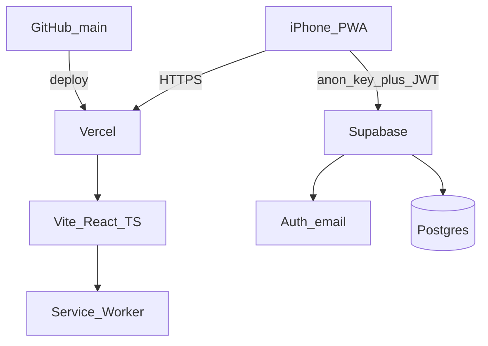
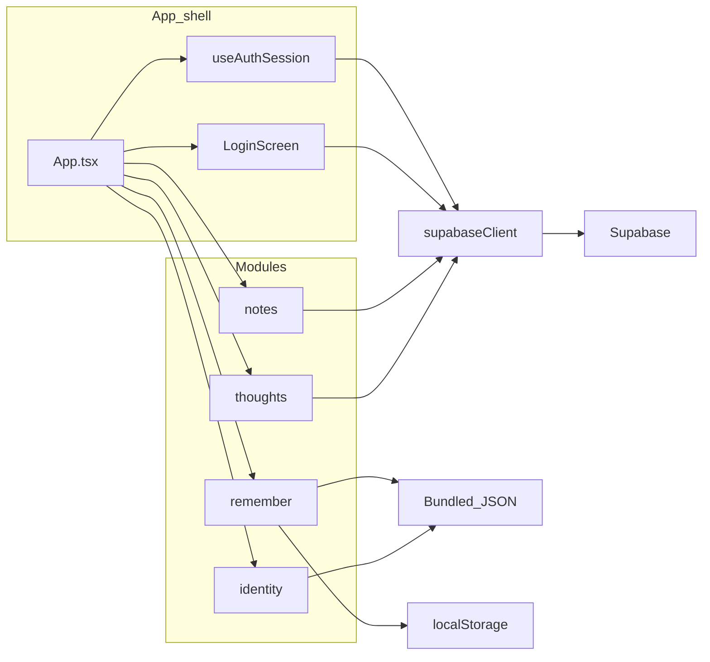
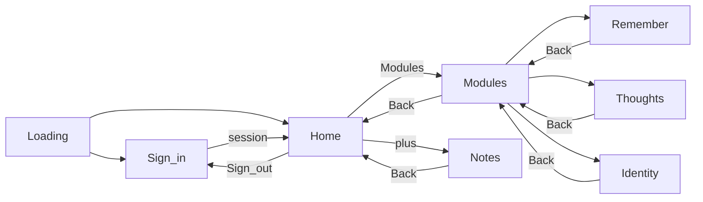
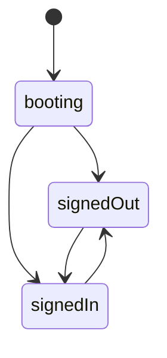
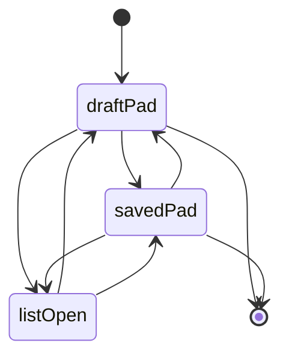
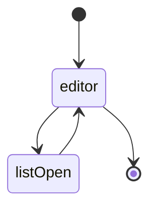
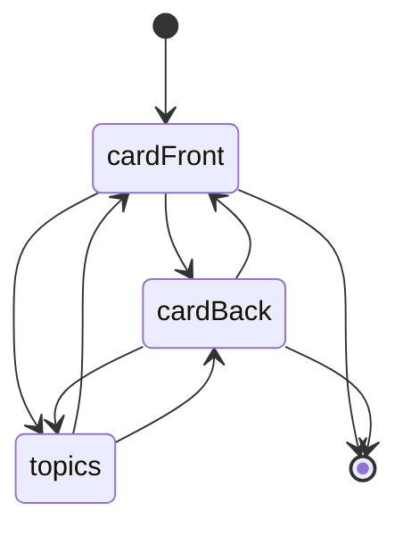
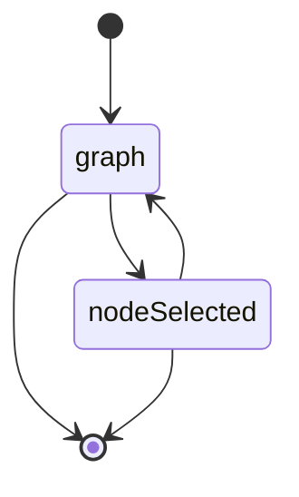

# Architecture — Second Brain `0.0.22`

For what exists **right now** and why (tabs, auth, product rules), start with [`current-state.md`](current-state.md). This file is a structural snapshot. Version is the home-screen string from `vite.config.ts` (`__APP_VERSION__`).

## Infra

- **Client**: Vite + React + TypeScript PWA (`vite-plugin-pwa`), session in `localStorage`.
- **Host**: Vercel from `main`.
- **Backend**: Supabase Auth (magic link, email+password) and Postgres (`notes`, `thoughts`) with RLS. Remember and Identity stay on-device (bundled JSON; Remember scores in `localStorage`).

## How things connect

- Shell owns view state and auth. Modules do not import each other.
- Notes and Thoughts talk to Supabase only through `getSupabaseClient()` and their own repository.
- Remember: `definitions306.json`, `spanishexam5.json`, memory scores in `localStorage`.
- Identity: `goalsGraph.json`.

## UX

## Modules

### Auth (shell)

Enter: no session. Exit: session present (or Sign out from Home).

### Notes

Enter: Home `+`. Exit: Back → Home.

### Thoughts

Enter: Modules → Thoughts. Exit: Back → Modules.

### Remember

Enter: Modules → Remember. Exit: Back → Modules.

### Identity

Enter: Modules → Identity. Exit: Back → Modules.

